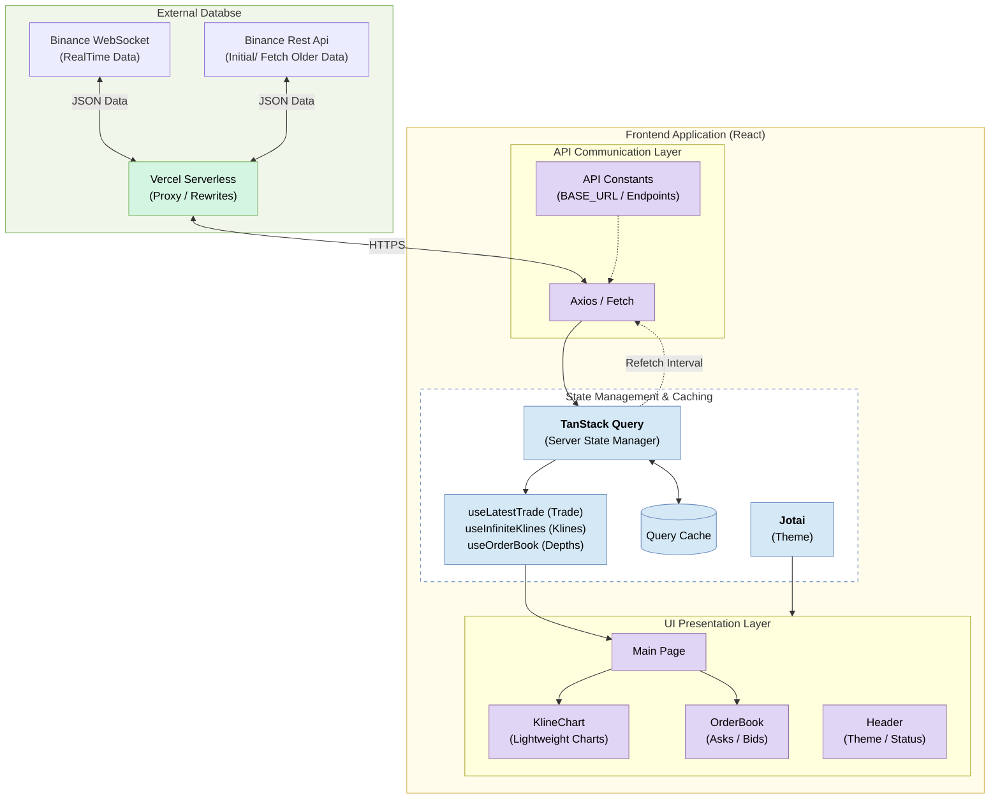

# AssetFrame : All-in-One Crypto Analytics Dashboard

**AssetFrame**은 가상 자산의 실시간 가격, 호가(Orderbook), 그리고 기술적 분석 지표를 한눈에 제공하는 **싱글 페이지 어플리케이션 (SPA)**입니다.

## 목차

1. [**개요**](#1-개요)
2. [**주요 기능**](#2-주요-기능)
3. [**시스템 아키텍처**](#3-시스템-아키텍처)
4. [**기술 스택**](#4-기술-스택)
5. [**차트**](#5-차트)
6. [**오더 북**](#6-오더-북)
7. [**보조 지표**](#7-보조-지표)

## 1. 개요

Full Function 차트는 실시간 가격, 오더북, 과거 차트 데이터 등 다양한 정보가 필요합니다. 개발 단계에서 이를 구현하기 위해서는 여러 플랫폼에 파편화되어 있는 API들을 끌어모아 합쳐야 하는 번거로운 과정이 수반됩니다.

**AssetFrame**은 이러한 불편을 해소하기 위해 설계되었습니다. **AssetFrame**은  Binance 데이터와 lightweight-charts를 기반으로 차트와 호가창을 구현하고, 클라이언트 사이드에서 즉시 계산되는 보조지표를 제공하여 편리하게 차트의 기능을 사용할 수 있는 대시보드입니다.

## 2. 주요 기능

- **실시간 가상 자산 가격** : Binance WebSocket을 연동하여 지연 없고 신뢰성 있는 실시간 가격을 제공합니다.
- **실시간 호가 (이하 오더북)** : 매수/매도 잔량과 체결 강도를 자체 호가창을 통해 실시간으로 제공합니다.
- **과거 가격 / 거래량 조회**: 드래그 앤 드롭으로 과거 데이터를 끊김 없이 로딩하며, 1초부터 1달까지 다양한 타임프레임을 지원합니다.
- **기술적 분석 / 보조 지표** : RSI, MACD, 볼린저 밴드 등 8종의 보조지표를 클라이언트에서 직접 연산하여 오버레이합니다.
- **테마, UI UX**: 다크/라이트 모드 전환 시 차트 및 UI 테마가 즉시 동기화됩니다. System Statu와 Sliding Number 등 동적인 UI를 제공합니다.

## 3. 시스템 아키텍처

## 4. 기술 스택

| **카테고리** | **기술 스택** |
| --- | --- |
| **프레임워크** | React, Vite, TypeScript |
| **상태 관리** | TanStack Query (Server State), Jotai (Client State) |
| **스타일** | Tailwind CSS, Shadcn UI, React-motion, Lucide-react |
| **데이터 시각화** | Lightweight-charts (TradingView Library) |
| **외부 API** | Axios, Binance Public API (REST/WebSocket) |

## 5. 차트

Lightweight-charts 라이브러리를 기반으로 생성된 캔들 차트입니다.

- **자산 가격 정보**: 최초 로딩 시 비트코인 1분봉 기준 500개의 캔들을 렌더링합니다. 좌측으로 스크롤 시 과거 캔들 정보를 제공합니다. 과거 정보는 Biancne가 제공하는 2017년 7월경의 정보까지 조회 가능합니다. 
- **타임프레임 선택**: 1초 봉부터 월 봉까지 유연한 시간 단위를 제공하며, 변경 시 기존 데이터를 즉시 재배열합니다.
- **심볼 관리**: 화이트리스트 기반의 종목들을 심볼 셀렉터를 통해 선택 가능하며, 검색 기능을 함꼐 지원합니다. 24시간 등락률과 아이콘을 함께 확인 가능합니다.
- **인터랙티브 툴팁**: 마우스 커서 위치에 따라 OHLC(시가/고가/저가/종가) 데이터를 계산하여 부드러운 모션으로 트래킹하는 툴팁을 제공합니다.

## 6. 오더 북

차트 우측에 배치되어 매수 / 매도 / Marked Price 정보를 제공하는 실시간 오더북입니다. 차트에서 선택된 심볼과 동기화됩니다.

- **Asks & Bids**: 매도(Asks)와 매수(Bids) 잔량을 각 20호가씩 제공합니다.
- **Mark Price**: 오더북 중앙에 현재 시장 평균가(Mark Price)를 실시간으로 업데이트합니다.
- **Data Columns**:
    - Price(USDT): 주문 가격
    - Amount: 주문 수량
    - Total: 해당 가격대의 총 주문 규모

## 7. 보조 지표

technicalindicators 라이브러리를 활용해 원시 캔들 데이터를 가공, 차트 위에 오버레이합니다. 사용자는 여러 지표를 동시에 활성화할 수 있습니다.

- **추세 지표 (Trend)**
    - **SMA / EMA**: 단순/지수 이동평균선을 통해 전반적인 가격 추세를 파악합니다.
    - **Bollinger Bands (BB)**: 표준편차를 활용해 가격의 변동성 밴드를 시각화합니다.
    - **MACD**: 장단기 이동평균의 수렴과 확산을 통해 추세 전환점을 포착합니다.
- **모멘텀 및 변동성 (Momentum & Volatility)**
    - **RSI**: 과매수/과매도 구간을 식별하는 상대 강도 지수입니다.
    - **Stochastic Oscillator**: 현재 가격의 상대적 위치를 백분율로 나타냅니다.
    - **ATR**: 시장의 평균적인 변동폭을 계산합니다.
- **거래량 지표 (Volume)**
    - **OBV**: 거래량 증감을 누적하여 주가 선행성을 예측합니다.